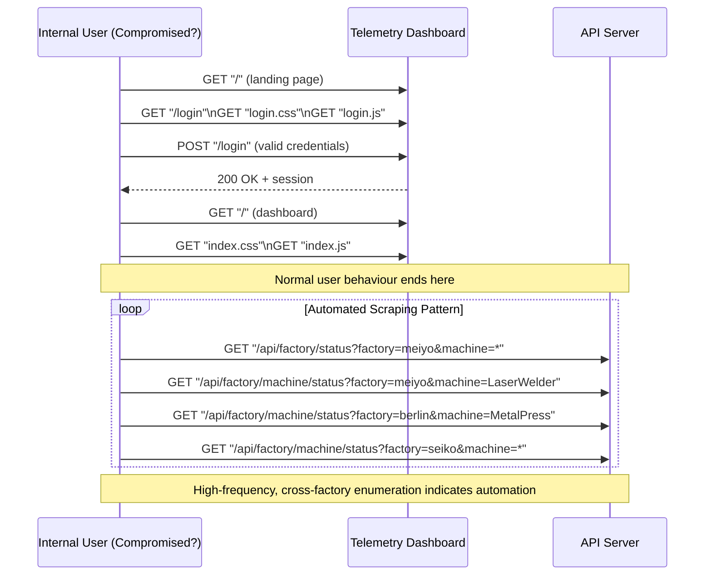

---

# **Web Log Forensics Investigation and Compromised Internal Account Analysis (Deloitte Cybersecurity Simulation)**

## **Background and Incident Context**

A recent news publication leaked sensitive private information belonging to Daikibo Industries, raising concerns that the company’s new manufacturing telemetry dashboard may have been compromised. According to the Deloitte case brief, Daikibo’s production line unexpectedly halted, disrupting operations and threatening downstream supply chains. Internal security analysts suspected that the internal factory status dashboard, recently deployed on Daikibo’s intranet, might have been accessed or misused in a way that triggered abnormal system behavior.

This investigation was conducted to determine whether the anomalous activity was caused by an external threat actor or by a compromised internal account. Through log forensics, behavioral pattern analysis, and Python-based detection, the goal is to identify Indicators of Compromise (IOCs), determine abnormal user actions, and evaluate whether the telemetry system was exposed or abused.

**Tools:** Linux (WSL Ubuntu), grep, awk, sort, uniq, Python 3, Mermaid.js, ShareX
**Log Source:** Deloitte Cybersecurity Virtual Experience
**File Analyzed:** `web_activity.log`

---

## Objective

Determine whether the anomalous system behavior originated from an external attacker or a compromised internal account by analyzing log structure, user activity patterns, machine-status enumeration, and internal vs. external IP sources.

---

# Methods

Below is the investigative workflow in the exact chronology you requested.

---

## 1. Reviewed raw log structure

The baseline structure of `web_activity.log` was examined to understand:

* How requests are grouped by internal IP
* Where `authorizedUserId` tokens appear
* Distinction between UI assets and high-value `/api/` operations
* How factory/machine-status enumeration requests are logged

**GIF:**


**Sample log excerpt:**

```text
192.168.0.101:
GET "/" (landing page)
GET "/login"
GET "login.css"
POST "/login" authorizedUserId: "mdB7yD2dp1BFZPontHBQ1Z"
GET "/api/factory/status?factory=meiyo&machine=*"
GET "/api/factory/machine/status?factory=meiyo&machine=LaserWelder"
...
```

---

## 2. Extracted and ranked unique user IDs

This step identifies which internal accounts generated the highest volume of requests.

```bash
grep -o 'authorizedUserId: "[^"]*"' ./web_activity.log \
  | awk -F'"' '{print $2}' \
  | sort | uniq -c | sort -nr | head -10
```

**Demo:**


**Output:**

```text
128 mdB7yD2dp1BFZPontHBQ1Z
31  obbi5BSPBt2K66ZGP8cYTJ
29  qNFgnHD22ck8SMyPkHA8U
28  keRUfaP4iWbD2rnmkeuSBV
27  dUUiwkPkH4tg3s2zQ2+fHiD
26  WGaAGjlLRkSGjVQo7HyqbQc
26  wcFSvNVcQVrEanqWHKDNENH
24  mTDksgxZBnf46F2y+FUPDMg
24  4vRoPdmUWE6oGzGucRGYi
23  qmRDXFY4FbUwp65paubkPDW
```

**Interpretation:**
One internal user (`mdB7yD2dp1BFZPontHBQ1Z`) generated **dramatically more activity** than every other account.

---

## 3. Analyzed machine-status enumeration

This identifies API enumeration patterns consistent with scripted automation.

```bash
grep '/api/factory/machine/status' ./web_activity.log \
  | grep -o 'machine=[A-Za-z0-9*]*' \
  | sort | uniq -c | sort -nr | head -10
```

**Demo:**


**Output:**

```text
389 machine=*
38  machine=HeavyDutyDrill
37  machine=Furnace
36  machine=MetalPress
34  machine=ConveyorBelt
31  machine=LaserCutter
31  machine=AirWrench
26  machine=LaserWelder
26  machine=CNC
13  machine=SpotWelder
```

**Interpretation:**

* `389` wildcard machine queries (`machine=*`) indicate **broad reconnaissance**.
* Enumeration spans multiple factories and dozens of machines.
* High repetition and breadth = **strong indicator of automated scraping**, not a human user.

---

## 4. Python detection and scoring tool

A custom script (`log_parser.py`) was used to automatically score suspicious IPs based on API behavior.

**Run:**

```bash
python3 log_parser.py ./web_activity.log
```

**Demo:**


**Output:**

```text
=== MOST SUSPICIOUS ACTIVITY DETECTED ===
IP: 192.168.0.101
User ID: mdB7yD2dp1BFZPontHBQ1Z
Suspicion score: 364
 - High API call volume (>15)
 - Rapid machine status enumeration (>100)
API calls: 122
Machine status calls: 121
```

**Interpretation:**
Workstation `192.168.0.101` and the associated user account triggered the **highest-risk activity**, aligning with IOC patterns observed in earlier steps.

---

## 5. Checked for any external IP activity

This step verifies whether any requests originated outside Daikibo’s internal network.

```bash
grep -Ev '^192\.168' ./web_activity.log | wc -l
```

**Demo:**


**Output:**

```text
0
```

**Interpretation:**
All traffic originated from internal RFC-1918 addresses.
No evidence of external intrusion.

---

# Modelled Activity Flow


The sequence diagram illustrates the full interaction flow between the user (or automated script), the telemetry dashboard, and the backend API server.
It highlights where normal authenticated dashboard usage ends and where malicious scripted activity begins.

The user accesses the dashboard and loads the login page normally.

After submitting valid credentials, the dashboard returns a session indicating a legitimate login event.

The user then loads the main dashboard interface, which is still consistent with expected behavior.

Immediately after this point, the pattern changes:
A loop of high-frequency API requests begins, targeting multiple factories and machines in rapid succession.

These repetitive calls to /api/factory/... endpoints indicate automated enumeration, not human navigation.

The diagram visually separates normal UI-driven actions from suspicious machine-status scraping.

This visualization helps demonstrate that the account first logged in legitimately, but then executed non-human, scripted behavior, supporting the conclusion of a compromised internal account.

---

# Findings

* No external IPs accessed the dashboard; all activity originated internally.
* User `mdB7yD2dp1BFZPontHBQ1Z` generated **over 128 logins** and **hundreds of factory/machine queries**.
* Workstation `192.168.0.101` produced the **largest volume of API calls**.
* `389` wildcard machine queries show automated enumeration across multiple factories.
* Behavior is consistent with a **compromised internal user account executing a scripted scraping tool**.

---

# Evidence & Reproducibility

**Key Files**

- [`web_activity.log`](./logs/web_activity.log)
- [`log_parser.py`](./scripts/log_parser.py)

---

# Conclusion & Recommendations

The suspicious activity originated internally from a compromised account running an automated enumeration script against factory telemetry APIs.

### Recommended Actions

* Reset credentials for user `mdB7yD2dp1BFZPontHBQ1Z` and enforce MFA.

* Forensically analyze workstation `192.168.0.101` for scripts, malware, or unauthorized automation.

* Implement API rate limiting and restrict wildcard machine queries.

* Deploy SIEM alert rules for:

  * Machine-status enumeration bursts
  * Cross-factory scanning
  * Abnormal user-based API volume

* Conduct full access/privilege review for the implicated account.

---

**Author:** Abdinoor Ahmed

Web Log Analysis, Cybersecurity Portfolio Lab

---

